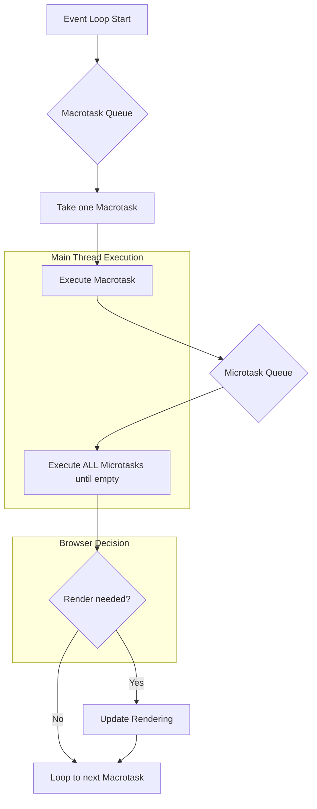

# 浏览器UI渲染与事件循环的深入解析

这是一个非常深入的好问题！浏览器UI渲染和事件循环（Event Loop）的关系是理解前端性能的关键。

简单来说，答案是：**渲染（UI Rendering）是事件循环中的一个环节。因此，无论微任务（Microtask）还是宏任务（Macrotask）执行时间过长，都会阻塞渲染，导致页面卡顿或无响应。**

下面我们来详细拆解这个过程。

### 1. 事件循环与渲染的关系

浏览器的事件循环模型可以概括为不断地从 **宏任务队列（Macrotask Queue）** 中取出一个任务执行。而在每个宏任务执行完毕后，会清空 **微任务队列（Microtask Queue）**。

**渲染**并不是每个循环都发生，而是由浏览器根据屏幕的刷新率（通常是60Hz，即约16.7ms一次）来决定何时更新视图。这个更新过程可以看作是事件循环中的一个特殊的、由浏览器控制的宏任务。

一个典型的事件循环“Tick”（单次循环）可以简化为以下步骤：

1.  **执行一个宏任务**：从宏任务队列中取出一个任务（例如 `script` 标签内的代码、`setTimeout` 回调、用户点击事件等）并执行。
2.  **执行所有微任务**：执行当前宏任务产生的所有微任务（例如 `Promise.then()`、`MutationObserver`），直到微任务队列为空。如果微任务执行过程中又产生了新的微任务，它们也会被加入队列并立即执行。
3.  **（可选）执行渲染**：在完成上述步骤后，浏览器有了一个“空闲”窗口。此时，它会判断是否需要进行UI渲染。这个判断基于以下几点：
    *   是否有DOM变动、样式修改等导致需要 **重排（Reflow）** 或 **重绘（Repaint）**。
    *   是否到达了下一次 **垂直同步（VSync）** 的时间点（大约16.7ms）。
4.  **执行渲染流程**：如果需要渲染，浏览器会执行一系列步骤：`Style` -> `Layout` -> `Paint` -> `Composite`。
5.  **循环**：回到步骤1，准备执行下一个宏任务。

这个流程可以用下面的图来表示：



### 2. 长时间任务如何影响渲染

**主线程是单线程的**。这意味着JavaScript的执行、页面布局、绘制等工作都在同一个线程上完成。当其中任何一个任务长时间占用主线程时，其他所有任务都必须等待。

#### a. 长时间的宏任务

如果一个宏任务（如一个`setTimeout`回调或一个点击事件处理函数）内部有非常耗时的计算，它会阻塞后续所有任务，包括渲染。

**示例：**

```javascript
document.getElementById('myButton').addEventListener('click', () => {
  console.log('Button clicked, starting heavy task...');

  // 模拟一个耗时2秒的计算
  const startTime = Date.now();
  while (Date.now() - startTime < 2000) {
    // Busy-waiting, blocking the main thread
  }

  console.log('Heavy task finished.');
});
```

当你点击按钮后：
1.  `click`事件作为宏任务被执行。
2.  `while`循环开始，**主线程被完全占用2秒**。
3.  在这2秒内，浏览器无法响应任何其他用户输入（例如再次点击、悬停等）。
4.  更重要的是，浏览器无法执行渲染步骤。即使你在点击后修改了DOM（例如 `button.textContent = 'Processing...'`），这个变化也无法被绘制到屏幕上，直到2秒后整个宏任务结束。
5.  结果就是：**页面冻结2秒**，然后控制台输出 "Heavy task finished."。

#### b. 长时间的微任务

长时间的微任务影响 **更加严重**。因为在一个事件循环“tick”中，**所有**微任务必须在渲染之前执行完毕。

**示例：**

```javascript
console.log('Script start');

Promise.resolve().then(() => {
  console.log('Microtask started, starting heavy task...');

  // 模拟一个耗时2秒的计算
  const startTime = Date.now();
  while (Date.now() - startTime < 2000) {
    // Busy-waiting, blocking the main thread
  }

  console.log('Microtask finished.');
});

setTimeout(() => {
  console.log('Macrotask (setTimeout) executed.');
}, 0);
```

代码执行流程：
1.  `script` 宏任务开始。`console.log('Script start')` 执行。
2.  `Promise.then()` 的回调被放入微任务队列。
3.  `setTimeout` 的回调被放入宏任务队列。
4.  `script` 宏任务执行结束。
5.  **事件循环检查微任务队列**，发现 `Promise.then()` 的回调。
6.  开始执行微任务。`while` 循环开始，**主线程被完全占用2秒**。
7.  在这2秒内，页面同样被冻结。
8.  2秒后，微任务结束。
9.  此时，**不仅渲染被阻塞了，连下一个宏任务（`setTimeout`）也被阻塞了**。
10. 微任务队列清空后，浏览器才有机会进行渲染，然后才会去宏任务队列中取出 `setTimeout` 的回调来执行。

### 总结

-   **关系**：UI渲染是事件循环的一个步骤，它发生在当前宏任务和所有微任务执行完毕之后。
-   **影响**：
    -   **长时间的宏任务**会阻塞后续的渲染和其他所有任务，导致页面卡顿。
    -   **长时间的微任务**同样会阻塞渲染，且它的优先级更高，会先于下一个宏任务执行，因此它不仅阻塞渲染，还会阻塞后续所有的宏任务（如用户交互、`setTimeout`等）。

### 如何避免？

为了保持页面流畅（理想情况是60fps，即每帧约16.7ms），任何单个任务（无论是宏任务还是微任务）都不应长时间占用主线程。
- **对于动画**：使用 `requestAnimationFrame`，它能保证你的代码在浏览器下一次重绘之前执行，是实现流畅动画的最佳选择。
- **对于长计算任务**：
    - 将其放入 **Web Worker** 中，在后台线程执行，不阻塞主线程。
    - 如果无法使用Worker，可以将大任务分解成许多小块，通过 `setTimeout(..., 0)` 分散到事件循环的不同“tick”中执行。 