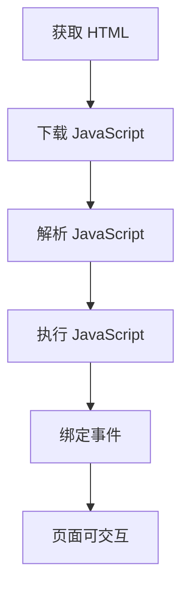
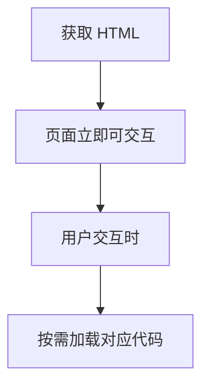
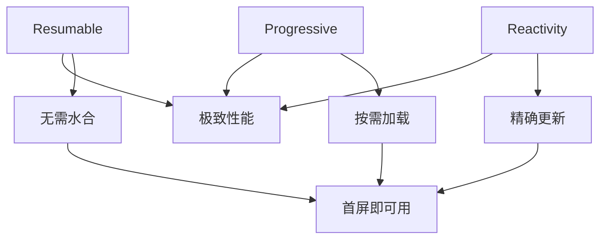

# Qwik 核心思想

Qwik 的核心理念建立在三大支柱之上：**Resumable**（可恢复性）、**Progressive**（渐进式）、**Reactivity**（响应式）。

## 1. Resumable (可恢复性)

### 传统的 Hydration (水合)

传统的 SSR 框架需要经过以下步骤：

1. 从服务端获取 HTML
2. 根据 HTML 下载所有的 JavaScript
3. 解析和执行 JavaScript
4. 恢复状态和绑定事件

这个过程被称为"水合"（Hydration），但它有明显的性能瓶颈：



### Qwik 的 Resumable 方式

Qwik 相比传统水合方式的优势：

- **首屏不需要下载所有 JavaScript**
- **首屏不需要绑定事件**
- **HTML 展示后即可用**



## 2. Progressive (渐进式)

### 核心特性

- **序列化 (Serialization)**：将状态、事件等信息序列化后保存在 DOM 的 Attribute 中
- **懒加载 (Lazy)**：尽可能地延迟下载执行脚本

### 实现方式

```html
<!-- 示例：on:click 会标注需要加载的脚本 -->
<button on:click="./chunk-abc123.js">Click me</button>
```

等到实际点击时再加载对应脚本，而不是立即绑定事件。

### 序列化机制

Qwik 将应用状态序列化到 HTML 中：

```html
<div q:id="0" q:host="">
  <script type="qwik/json">
    {
      "refs": {...},
      "ctx": {...},
      "objs": [...],
      "subs": [...]
    }
  </script>
</div>
```

## 3. Reactivity (响应式)

### 基于 Signal 的实现

Qwik 使用 Signal 概念实现响应式：

- **响应式触发**
- **可缓存**
- **无需频繁重渲染整个组件**

官方描述：`useState + useRef + useMemo - 重渲染`

类似 Vue 的响应式实现。

### Signal vs 传统状态管理

```javascript
// 传统 React 方式
function Counter() {
  const [count, setCount] = useState(0);
  
  return (
    <div>
      <p>Count: {count}</p>
      <button onClick={() => setCount(count + 1)}>
        Increment
      </button>
    </div>
  );
}

// Qwik Signal 方式
function Counter() {
  const count = useSignal(0);
  
  return (
    <div>
      <p>Count: {count.value}</p>
      <button onClick$={() => count.value++}>
        Increment
      </button>
    </div>
  );
}
```

### 响应式的优势

1. **精确更新**: 只更新变化的 DOM 节点
2. **性能优化**: 避免不必要的重渲染
3. **内存效率**: 减少组件实例的创建和销毁

## 三大核心思想的协作

这三个核心思想相互配合，形成了 Qwik 独特的架构：



### 实际应用示例

```javascript
// 一个完整的 Qwik 组件示例
import { component$, useStore, useSignal } from '@builder.io/qwik';

export default component$(() => {
  // 使用 useStore 创建响应式状态
  const store = useStore({ count: 0 });
  const name = useSignal('World');
  
  return (
    <div>
      <h1>Hello {name.value}!</h1>
      <p>Count: {store.count}</p>
      
      {/* onClick$ 表示这个函数会被拆分到单独的 chunk */}
      <button onClick$={() => store.count++}>
        Increment
      </button>
      
      {/* 复杂逻辑也会被懒加载 */}
      <button onClick$={() => {
        // 这个函数会被编译成单独的 chunk
        const result = expensiveCalculation();
        console.log(result);
      }}>
        Calculate
      </button>
    </div>
  );
});

// 这个函数会被自动拆分
function expensiveCalculation() {
  // 复杂计算逻辑
  return Math.random() * 1000;
}
```

---

**下一步**: 深入了解 [Qwik 原理](./qwik-principles.md) 