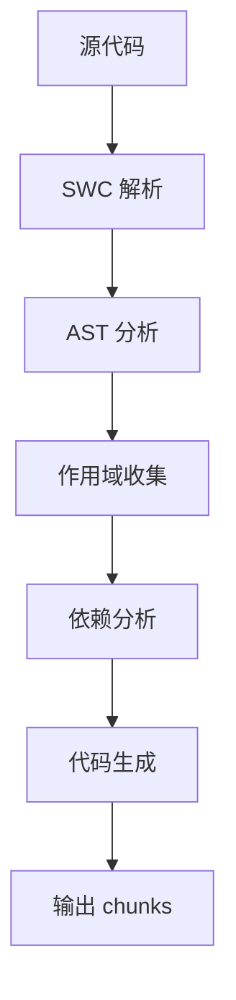

# Qwik Optimizer

Qwik Optimizer 是 Qwik 的核心编译工具，负责代码拆分、优化和转换。

## 简介

Qwik Optimizer 是 Qwik 单独抽离的包：

- **基于 Rust 编写**：提供 WASM 包，性能极高
- **编译构建**：压缩、Tree Shaking 等
- **序列化处理**：在编译阶段确定序列化数据
- **代码拆分**：提供 `$`、`Component$` 等方法

## $ 方法原理

### 传统 Lazy Load

```javascript
// 传统方式：手动分离 chunk
// calculate.js
export function calculate() {
  // 重逻辑
  return heavyCalculation();
}

// main.js
async function main() {
  if (someCondition) {
    const { calculate } = await import('./calculate.js');
    calculate();
  }
}
```

### Qwik 的 $ 方法

```javascript
// Qwik 方式：自动分包
function main() {
  const calculate = $(() => {
    // 重逻辑
    return heavyCalculation();
  });
  
  if (someCondition) {
    calculate();
  }
}
```

### $ 方法的优势

1. **自动化**：无需手动分离代码
2. **细粒度**：可以拆分到函数级别
3. **智能分析**：自动分析依赖关系
4. **开发体验**：编写代码时无需考虑分包

## 编译原理

### 基于 SWC

- **SWC**：基于 Rust 的 JavaScript 编译工具
- **性能**：四核线程中比 Babel 快 70 倍
- **AST 解析**：对传入文件进行抽象语法树解析

### 编译流程



### 作用域收集

Optimizer 会收集不同层级的作用域：

1. **全局作用域**：收集 import/export
2. **函数作用域**：收集函数内变量
3. **$ 调用处理**：收集依赖的标识符

```javascript
// 作用域分析示例
function parentFunction() {
  const outerVariable = 'test';
  const outerObj = { value: 1 };
  
  // Optimizer 会分析这个 $ 函数的依赖
  const fn = $(() => {
    console.log(outerVariable); // 依赖 outerVariable
    outerObj.value++;           // 依赖 outerObj
  });
}
```

## 依赖处理

### 编译前后对比

```javascript
// 编译前
function main() {
  const outerVariable = 'test';
  const outerObj = { value: 1 };
  
  const fn = $(() => {
    console.log(outerVariable);
    outerObj.value++;
  });
}

// 编译后 - 新 chunk (chunk-abc123.js)
export function s_abc123() {
  const [outerVariable, outerObj] = useLexicalScope();
  console.log(outerVariable);
  outerObj.value++;
}

// 编译后 - 原 chunk
function main() {
  const outerVariable = 'test';
  const outerObj = { value: 1 };
  
  const fn = qrl('./chunk-abc123.js', 's_abc123', [outerVariable, outerObj]);
}
```

### 依赖分析算法

```javascript
// 伪代码：依赖分析过程
function analyzeDependencies(astNode) {
  const dependencies = [];
  
  // 遍历 AST 节点
  traverse(astNode, {
    Identifier(node) {
      // 检查是否是外部变量
      if (isExternalVariable(node)) {
        dependencies.push(node.name);
      }
    }
  });
  
  return dependencies;
}
```

## QRL 运行时

### QRL 函数实现

```javascript
// QRL 函数的基本结构
function qrl(chunkUrl, symbolName, captureData) {
  return {
    $chunkUrl$: chunkUrl,
    $symbol$: symbolName,
    $captureRef$: captureData,
    
    // 执行时动态导入
    invoke: async () => {
      const module = await import(chunkUrl);
      const fn = module[symbolName];
      
      // 设置词法作用域
      setLexicalScope(captureData);
      
      return fn();
    }
  };
}
```

### 延迟执行机制

```javascript
// 延迟执行的实现
class LazyFunction {
  constructor(qrl) {
    this.qrl = qrl;
    this.loaded = false;
    this.fn = null;
  }
  
  async invoke(...args) {
    if (!this.loaded) {
      this.fn = await this.qrl.invoke();
      this.loaded = true;
    }
    
    return this.fn(...args);
  }
}
```

## 优化策略

### 1. 静态分析优化

```javascript
// 编译时可以确定的优化
function optimizeStaticCalls() {
  const staticValue = 'hello';
  
  // 这个函数不依赖外部变量，可以优化
  const fn = $(() => {
    console.log('static function');
  });
  
  // 这个函数依赖外部变量，需要捕获
  const fn2 = $(() => {
    console.log(staticValue);
  });
}
```

### 2. 树摇优化

```javascript
// 未使用的代码会被移除
function unusedFunction() {
  // 这个函数如果没有被使用，会被树摇掉
  const fn = $(() => {
    console.log('unused');
  });
}
```

### 3. 内联优化

```javascript
// 简单的 $ 函数可能被内联
const simpleHandler = $(() => {
  console.log('simple');
});

// 复杂的 $ 函数会被拆分
const complexHandler = $(() => {
  // 大量逻辑
  performComplexCalculation();
  updateMultipleStates();
  triggerMultipleEffects();
});
```

## 编译配置

### 基础配置

```javascript
// vite.config.js
import { defineConfig } from 'vite';
import { qwikVite } from '@builder.io/qwik/optimizer';

export default defineConfig({
  plugins: [
    qwikVite({
      // 优化配置
      optimization: {
        // 最小 chunk 大小
        minChunkSize: 1000,
        // 最大 chunk 大小
        maxChunkSize: 5000,
        // 内联阈值
        inlineThreshold: 500,
      },
      
      // 调试配置
      debug: {
        // 显示编译信息
        verbose: true,
        // 输出 chunk 信息
        chunks: true,
      }
    })
  ]
});
```

### 高级配置

```javascript
// 自定义 Optimizer 配置
export default defineConfig({
  plugins: [
    qwikVite({
      // 自定义转换规则
      transforms: {
        // 自定义 $ 函数处理
        $: {
          // 忽略某些函数
          ignore: ['debugFunction'],
          // 强制内联
          inline: ['simpleFunction'],
        }
      },
      
      // 输出配置
      output: {
        // chunk 命名规则
        chunkFileNames: 'chunks/[name]-[hash].js',
        // 资源目录
        assetsDir: 'assets',
      }
    })
  ]
});
```

## 性能指标

### 编译性能

- **编译速度**：比 Babel 快 70 倍
- **内存使用**：Rust 实现，内存效率高
- **并行处理**：支持多核并行编译

### 运行时性能

- **chunk 大小**：平均 1-3KB 每个 chunk
- **加载时间**：按需加载，减少初始包大小
- **执行效率**：预编译优化，运行时开销小

### 优化效果对比

| 指标 | 传统打包 | Qwik Optimizer |
|------|----------|----------------|
| 初始包大小 | 50KB+ | 1KB |
| 首次交互时间 | 500ms+ | 100ms |
| 代码拆分粒度 | 模块级 | 函数级 |
| 构建时间 | 较长 | 很快 |

---

**下一步**: 了解 [Qwik 拓展工具](./qwik-extension-tools.md) 