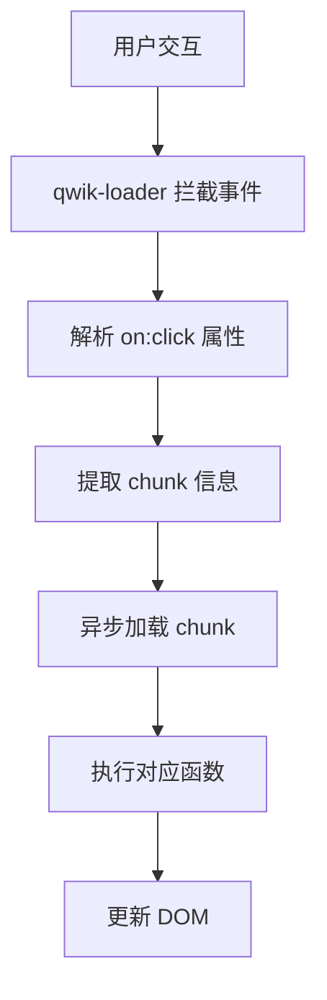
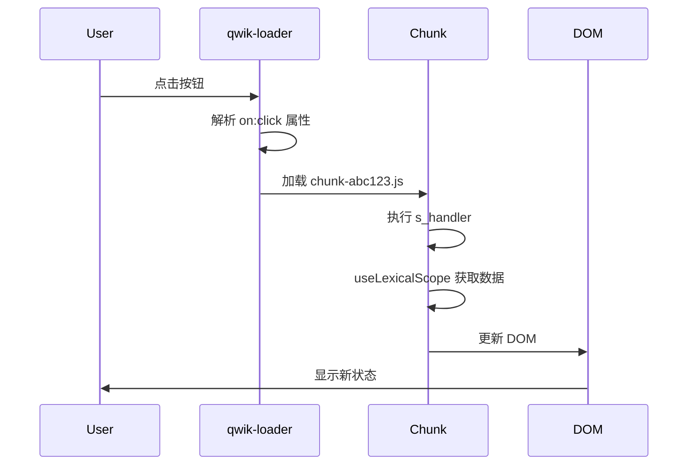

# Qwik 原理

深入理解 Qwik 的工作原理，包括编译过程、运行时机制和响应式系统。

## Demo 分析

让我们通过一个简单的计数器示例来理解 Qwik 的工作原理：

```jsx
// 示例代码
function Counter() {
  const store = useStore({ count: 0 });
  
  return (
    <div>
      <p>Count: {store.count}</p>
      <button onClick$={() => store.count++}>
        Increment
      </button>
    </div>
  );
}
```

## 编译结果分析

编译后的 HTML 包含：

1. **事件标记**：`on:click` 属性标记点击时要加载的 bundle
2. **状态信息**：序列化的状态数据
3. **qwik-loader**：初始代码，执行 qwikloader 并推入事件

### 编译后的 HTML 结构

```html
<div q:id="0" q:host="">
  <p>Count: 0</p>
  <button on:click="./chunk-abc123.js#s_handler#[0]">
    Increment
  </button>
  
  <script type="qwik/json">
    {
      "refs": {
        "0": {"count": 0}
      },
      "ctx": {},
      "objs": [
        {"count": 0}
      ],
      "subs": []
    }
  </script>
</div>
```

## qwik-loader 原理

qwik-loader 是 Qwik 的核心运行时，只有 1KB 大小，主要作用：

1. **注册全局事件**：拦截用户交互触发的事件
2. **解析元素属性**：当用户点击时，解析元素上的 attribute
3. **加载 chunk**：异步加载并执行 attribute 上声明的 chunk

### 事件格式

```
chunk#symbol#capture
```

- `chunk`：JavaScript 文件路径
- `symbol`：要执行的函数名
- `capture`：依赖的数据索引

### qwik-loader 工作流程



## 动态加载机制

### 加载 chunk

当事件触发时：

1. 加载对应的 chunk
2. 使用 `useLexicalScope` 函数获取数据
3. 从 capture data 数组中获取所需数据

### useLexicalScope 原理

useLexicalScope 是 Qwik 的核心函数，主要完成两个关键步骤：

1. **解析 QRL 函数**：
   - 根据上下文信息解析出 QRL 函数
   - 标记 chunk 信息
   - 挂载到全局上下文

2. **恢复应用状态**：
   - 根据 qwik/json 恢复当前应用数据
   - 包含 refs、ctx、objs、subs 等信息

```javascript
// useLexicalScope 使用示例
function s_handler() {
  const [store] = useLexicalScope();
  store.count++;
}
```

### qwik/json 结构

```json
{
  "refs": "元素依赖的数据",
  "ctx": "上下文，类似 React 的 context", 
  "objs": "要恢复的数据类型和初始值",
  "subs": "订阅者信息（响应式相关）"
}
```

## 响应式实现

### Signal 基础实现

```javascript
// Signal 基本原理
class Signal {
  constructor(value) {
    this.value = value;
    this.subscribers = new Set();
  }
  
  get() {
    // 收集依赖
    if (currentSubscriber) {
      this.subscribers.add(currentSubscriber);
    }
    return this.value;
  }
  
  set(newValue) {
    if (this.value !== newValue) {
      this.value = newValue;
      // 通知依赖更新
      this.subscribers.forEach(subscriber => {
        subscriber.notify();
      });
    }
  }
}
```

### LocalSubscriptionManager

负责管理订阅和通知：

- 调用 `notifyChange`
- 最终更新 UI
- 更新流程：虚拟节点 → DOM 元素

```javascript
class LocalSubscriptionManager {
  constructor() {
    this.subscriptions = new Map();
  }
  
  notifyChange(signal) {
    const subscribers = this.subscriptions.get(signal);
    if (subscribers) {
      subscribers.forEach(subscriber => {
        subscriber.update();
      });
    }
  }
}
```

### SignalDerived

```javascript
// 类似 Vue 的 computed
class SignalDerived {
  constructor(computeFn) {
    this.computeFn = computeFn;
    this.cached = null;
    this.isDirty = true;
  }
  
  get value() {
    if (this.isDirty) {
      this.cached = this.computeFn();
      this.isDirty = false;
    }
    return this.cached;
  }
}
```

### useStore 实现

```javascript
// useStore 返回 Proxy
function useStore(initialState) {
  const store = { ...initialState };
  
  return new Proxy(store, {
    get(target, prop) {
      // 劫持 get，收集依赖
      collectDependency(target, prop);
      return target[prop];
    },
    
    set(target, prop, value) {
      // 劫持 set，通知更新
      if (target[prop] !== value) {
        target[prop] = value;
        notifyChange(target, prop);
      }
      return true;
    }
  });
}
```

## 完整的执行流程

让我们通过一个完整的示例来理解 Qwik 的执行流程：

### 1. 编译阶段

```javascript
// 源代码
function Counter() {
  const store = useStore({ count: 0 });
  
  return (
    <button onClick$={() => store.count++}>
      {store.count}
    </button>
  );
}

// 编译后的代码
function Counter() {
  const store = useStore({ count: 0 });
  
  return (
    <button on:click="./chunk-abc123.js#s_handler#[0]">
      {store.count}
    </button>
  );
}

// 生成的 chunk (chunk-abc123.js)
export function s_handler() {
  const [store] = useLexicalScope();
  store.count++;
}
```

### 2. 运行时阶段



### 3. 状态更新流程

```javascript
// 1. 用户点击按钮
// 2. qwik-loader 拦截事件
// 3. 解析 on:click="./chunk-abc123.js#s_handler#[0]"
// 4. 加载 chunk-abc123.js
// 5. 执行 s_handler 函数
function s_handler() {
  // 6. 获取捕获的数据
  const [store] = useLexicalScope();
  
  // 7. 修改状态
  store.count++; // 触发 Proxy 的 set 方法
  
  // 8. notifyChange 通知更新
  // 9. 更新对应的 DOM 节点
}
```

## 性能优化策略

### 1. 代码拆分

Qwik 自动将代码拆分成最小粒度的 chunk：

- 每个事件处理函数都是单独的 chunk
- 只有被触发的代码才会被加载
- 避免加载不必要的代码

### 2. 状态管理优化

- 使用 Proxy 精确追踪状态变化
- 只更新发生变化的 DOM 节点
- 避免不必要的重渲染

### 3. 内存管理

- 延迟创建组件实例
- 自动清理不再使用的资源
- 最小化内存占用

---

**下一步**: 了解 [Qwik Optimizer](./qwik-optimizer.md) 的工作原理 